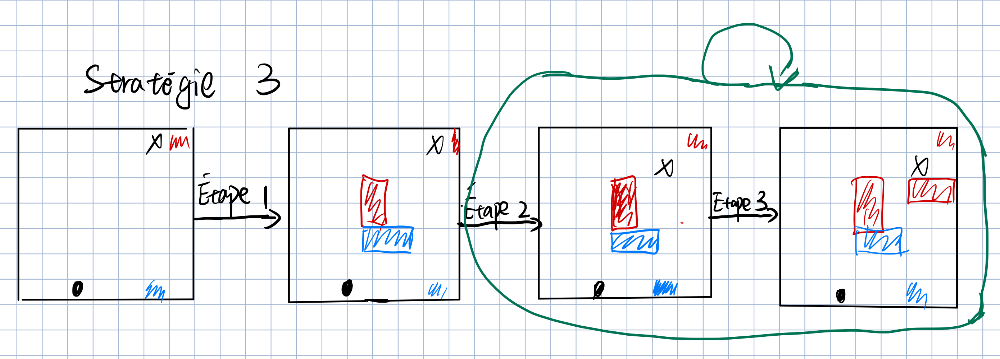

# Rapport de projet

## Groupe

- Groupe 2
- Zhang Zhile 21201131
- Zhang Jiawen  21117173

## Introduction

Dans ce jeu, nous avons proposé quatre stratégies au total : une stratégie aléatoire, une stratégie utilisant l'algorithme Alpha-Beta et deux stratégies personnelles. 

Tous les codes sont dans le fichier [main.py](http://main.py/). Ils sont divisés en sept parties( Divisés par des symboles de commentaire):

1. La première partie est constituée de quelques paramètres d'initialisation qui étaient présents dans la version initiale et qui ont peu changé.
2. Les quatre parties suivantes étant les codes de ces quatre stratégies. 
3. La partie suivante est notre partie de test, où les fonctions `def jouer_joueur_aleatoire()` `def jouer_algo_S3()`, `def jouer_alphaB()`. Elles sont utilisées pour tester les résultats de deux joueurs utilisant la même stratégie dans un jeu, principalement pour vérifier si des erreurs se sont produits ou si la stratégie fonctionne correctement.
4. Enfin, la dernière partie est la partie de confrontation, où les joueurs utilisent des stratégies différentes pour jouer au jeu. Après plusieurs confrontations de jeu, les avantages et les inconvénients de chaque stratégie seront évalués.

## Description des stratégies proposées ********et******** des choix importants d'implémentation

### 1. Stratégie aléatoire/random

- s'il reste au moins un mur à placer, le joueur choisit au hasard entre se déplacer et placer un mur.
    - s'il choisit de poser un mur celui-ci sera déposé au hasard sur une position légale
    - s'il choisit de se déplacer le joueur choisit le plus court chemin à un de ses objectifs (n'importe quelle position sur la ligne qui lui permet de gagner)

### 2.  Stratégie par l’algo Alpha-Beta

L'algorithme Alpha-beta est une optimisation de l'algorithme très petit et très grand. Il est basé sur une fonction d'évaluation de l'état de recherche actuel, et le processus de recherche est accéléré par un algorithme d'optimisation de l'élagage de l'arbre de recherche pour trouver la solution optimale. Dans l'arbre de recherche, Alpha désigne la limite inférieure de la meilleure évaluation actuelle et Bêta désigne la limite supérieure de la meilleure évaluation actuelle. Lorsque le processus de recherche constate que la valeur d'un nœud se situe en dehors de la fourchette Alpha-Bêta, le nœud peut être élagué car il n'aura pas d'effet sur le résultat final.

Cette stratégie met en œuvre l'algorithme Alpha-Beta de coupe dans l'arbre de jeu. Son idée principale consiste à partir de l'état actuel, à générer tous les états successeurs possibles, puis à appliquer l'algorithme de coupe Alpha-Beta à chaque état successeur pour déterminer le meilleur mouvement ou position de mur à placer pour la prochaine étape. Ainsi, le joueur peut se rapprocher de son objectif en fonction du meilleur mouvement et empêcher l'avancement de l'adversaire. 

Dans cette stratégie, nous avons quelques fonctions importantes et des implémentations de base:

- `def evaluation_function` : Calcule la valeur d'évaluation pour un état donné. La valeur d'évaluation reflète la qualité ou la médiocrité d'un état pour un joueur, dans ce cas la valeur de retour est toujours la valeur de la longueur du chemin du min_joueur moins la longueur du chemin du max_joueur.
- `def successor_function` : Génère tous les états successifs possibles pour le joueur dans un état donné, y compris le mouvement et les placements des murs.
- `def alpha_beta_search` : Un algorithme d'élagage alpha-beta pour rechercher le meilleur état, utilisé pour évaluer le successeur de l'état actuel. Elle est récursive pour représente le jeu comme un arbre.
- `def trouve_meilleur_move` : Utilisé pour trouver le meilleur mouvement ou placement des murs pour le joueur actuel dans l'état actuel, en appelant `def alpha_beta_search` pour déterminer la meilleure valeur pour l'état suivant.

### 3. Stratégie 3 personnelle

Prenons l'exemple de deux joueurs qui utilisent tous deux cette stratégie

Cette stratégie se compose de trois étapes : 

1. Les joueurs placent arbitrairement des murs, mais les positions des murs doivent être légale.
2. Si le joueur a des murs restants, il compare la longueur de son propre chemin et celle de son adversaire. Si le chemin de l'adversaire est plus court que le sien, il place de murs. En parcourant toutes les positions de murs légales, il cherche une position de mur qui lui permettra de raccourcir son propre chemin par rapport à celui de l'adversaire. S'il ne trouve pas une telle position de mur, il se déplace. Si le joueur n'a plus de murs, il se déplace directement.
3. Le joueur adverse agit de la même manière que ci-dessus.

Ensuite, les étapes 2 et 3 sont répétées en boucle jusqu'à ce qu'un joueur atteigne son objectif.

Dans cette stratégie, nous une fonction importante et des implémentations de base:

`def algo_S3`:  Cette fonction permet de mettre en œuvre l'algorithme écrit à l'étape 2 ci-dessus.

### 4. Stratégie 4 cooperation (Personnelle)

Pour cette stratégie basée sur la coopération réciproque, chaque joueur commence par évaluer si l'autre joueur a l'intention de coopérer. Si tel est le cas, nous privilégions également la coopération avec l'autre joueur, mais si l'autre joueur n'adopte pas de stratégie de coopération ou adopte une stratégie de confrontation, nous nous adaptons en renforçant la confrontation ou en maintenant la stratégie actuelle.

- `def evaluation` : La fonction d'évaluation attribue un score au joueur en fonction de l'état actuel du jeu, y compris la position du joueur, les informations sur les murs et la position de l'objectif. Le score dépend principalement de la distance entre le joueur et la position cible, ainsi que du nombre de murs restants. Plus la distance est courte et plus il y a de murs restants, plus le score est élevé.
- `def est_cooperatif` : La fonction de coopération est utilisée pour déterminer si le joueur adopte une stratégie coopérative. Après avoir évalué la situation, nous pouvons prioriser le maintien de relations de coopération avec les autres joueurs. Cela signifie éviter de bloquer les chemins des autres joueurs autant que possible, surtout lorsque ce blocage n'affecte pas directement notre propre victoire.
- `def trouve_meilleur_move1` : Cette fonction trouve le meilleur mouvement possible pour le joueur en fonction de la fonction d'évaluation. Elle calcule d'abord les scores d'évaluation pour tous les mouvements légaux possibles à l'état actuel, puis choisit le mouvement avec le score le plus élevé comme meilleur mouvement.
- `def comportement_adaptatif` : La fonction de comportement adaptatif ajuste la stratégie du joueur en fonction de l'état actuel du jeu et du comportement de l'adversaire. Elle détecte d'abord si l'adversaire adopte une stratégie coopérative, puis ajuste sa propre stratégie en conséquence. Par exemple, si l'adversaire adopte une stratégie coopérative, le joueur peut choisir une stratégie de coopération ou de confrontation; si l'adversaire adopte une stratégie de confrontation, le joueur peut choisir de renforcer la confrontation ou de maintenir sa stratégie actuelle.

## Description des résultats

Chaque confrontation on a répété 30 fois

Alpha-beta contre Random a testé 50 fois

|  | Alpha-beta | S3 | S4 |
| --- |------------| --- | --- |
| Random | (1, 49)    | ( 2, 28) | (5, 25) |

|  | Random  | S3 | S4 |
| --- |---------| --- | --- |
| Alpha-beta | (49, 1) | (27, 2) | (28, 2) |

|  | Random | Alpha-beta | S4 |
| --- | --- | --- | --- |
| S3 | (28, 2) | (2, 27) | (17, 13) |

|  | Random | Alpha-beta | S3 |
| --- | --- | --- | --- |
| S4 | (25, 5) | (2, 28) | (13, 17) |

La stratégie aléatoire,  due à la règle aléatoire, le résultat est le pire, ce qui est normal. Lorsqu'il est confronté à d'autres stratégies, il ne peut presque jamais gagner.

La stratégie 3 (personnelle),  le problème avec cette stratégie est que son objectif principal est de bloquer le chemin de l'adversaire pour que notre propre chemin soit temporairement plus court que celui de l'adversaire. Cependant, nous n'avons pas de prévisions sur le prochain mouvement de l'adversaire, donc il est possible que notre propre chemin soit plus long que celui de l'adversaire dans ce tour. De plus, l'adversaire peut prévoir les prochains tours en utilisant d'autres stratégies et trouver une solution plus optimale, ce qui signifie que nous ne pouvons plus raccourcir la différence de chemin, peu importe le nombre de murs que nous posons ou de mouvements que nous faisons, et finalement perdre.

La stratégie 4 cooperation inconvénient : si l'écart initial entre les chemins n'atteint pas le seuil du mur et que la stratégie de l'adversaire ne fait pas de mur, la stratégie peut choisir de coopérer en permanence, ce qui permet à l'adversaire de gagner facilement.

Stratégie 3 et Stratégie 4 ont des résultats similaires qui sont moins bons que la stratégie Alpha-beta, et meilleurs que la stratégie aléatoire. Lorsqu'elles s'affrontent, les résultats de S3 et S4 ne diffèrent pas beaucoup.

La stratégie Alpha-beta, Il s'agit de la meilleure stratégie parmi les quatre, car elle remporte toujours une victoire importante sur les autres stratégies. Cette stratégie idéalise toujours l'adversaire, ce qui peut ne pas être la meilleure action à prendre, mais qui est toujours meilleure que les autres stratégies.